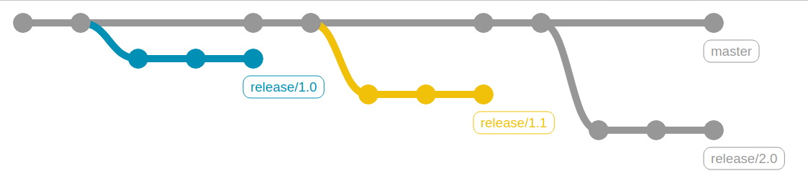
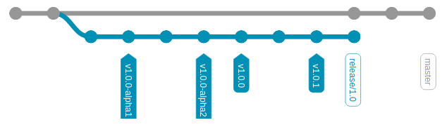

# Versioning scheme

This project adheres to a [semantic versioning scheme](https://semver.org/),
with `MAJOR`.`MINOR`.`PATCH`-`LABEL`

- `MAJOR`: Introduces backward incompatible changes to the API
- `MINOR`: Introduces new features without breaking backward compatibility
- `PATCH`: Only simple bugfixes
- `LABEL`: Marks a pre-released version or release candidate

We will try to keep only a *single* line of development on the `master`
branch, and from this branch off to tag new releases. The type of release
(`MAJOR` or `MINOR`) is determined by the nature of the introduced changes.
`MAJOR` changes should not be introduced lightly, and could be held back at pull
request-level in anticipation of prior `MINOR` release(s). Once a new `MAJOR` is
released, the development on the old `MAJOR` is terminated and no `MINOR` pull
requests will be accepted on top of old `MAJOR`s, only simple `PATCH`es.

# Branching model

In the following, X, Y and Z should *always* be substituted with appropriate
numeric values, they should never appear as 'X', 'Y' or 'Z' in any version or
branch name.

The upstream MRChemSoft/mrcpp repository should contain only two kinds of
branches: the `master` branch which represents the main development line, as
well as a separate `release/X.Y` branch for each `MINOR` release. All `PATCH`
releases are applied linearly on the `MINOR` release branches.

## The `master` branch:



- This branch should *not* carry any release tags
- New features should *always* be directed to this branch
- Bugfixes may be directed to this branch
- Bugfixes may be *cherry-picked* from `release` branches, but *never* merged
- The VERSION file should point to the next *expected* release,
  and *always* carry the pre-release label `-alpha`
- When a new `release/X.Y` branch is created, the VERSION file on `master`
  is bumped to the next expected `MAJOR`/`MINOR`, i.e. `X.(Y+1).0-alpha` or
  `(X+1).0.0-alpha`

## The `release/X.Y` branches:



- This branch should carry *all* release tags associated with the `X.Y` `MINOR`
  release, including `PATCH`es and release candidates `-alpha1`, `-alpha2`, etc
- The VERSION file should point to the *latest* release tag on this branch
- The creation of this branch marks a feature freeze for version `X.Y`
- New features should *never* be directed to this branch
- Bugfixes and release preparations may be directed to this branch
- Bugfixes may be *cherry-picked* from `master`, but *never* merged

# Contributing

All code changes are incorporated through the `fork -> pull request (PR) ->
code review` work flow, with the following principles:

- New features should *always* branch off `master`
- Bugfixes may branch off either `master` or `release/X.Y`
- PRs should *always* be directed back at its original base branch, `master` or
  `release/X.Y`
- Bugfixes should be small and specific (cherry-pickable)
- Cherry-picks between `master` and `release` branches will be handled by code
  administrators
- All version tagging and changes to the VERSION file will be handled by code
  administrators, and should *not* be part of any PR

## Contributing a new feature:

- Always start from latest `master`
- Branch off to a local feature branch
- Implement new feature
- Regularly incorporate the latest changes from `master`, by merging or
  (preferably) rebasing
- File PR from the local feature branch back to `master`

## Contributing a bugfix:

- Start from latest appropriate branch, `master` or `release/X.Y`
- Branch off to a local bugfix branch
- Implement bugfix
- Regularly incorporate the latest changes from original branch by *rebasing*
- File PR from the local bugfix branch back to original branch
- Evaluate whether the bugfix should be cherry-picked to other branches
  and communicate it to the administrators


# Automatic formatting

You can install Git hooks to keep in check formatting and licensing headers:

```
cd .git/hooks
ln -s ../../.githooks/* .
```

